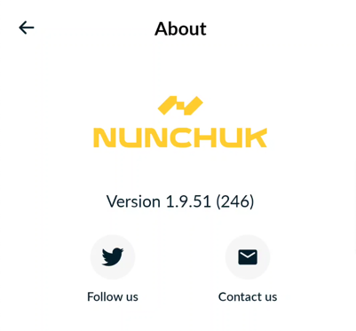

# Reproducible Builds
This page provides step-by-step instructions to build and verify that the version of the app downloaded from the Play Store matches the source code in our public repository.

## Step-by-step instructions

### 0. Prerequisites
Before you begin, ensure you have the following installed:
- `git`
- `docker` ([link](https://www.docker.com/))
- `python` (version 3.x)
- `adb` ([link](https://developer.android.com/tools/adb))
- `bundletool` ([link](https://github.com/google/bundletool/releases))

### 1. Confirm which version you have installed on your Android device
On the Nunchuk app, navigate to Profile > About. You should see the app version here:




In the above example, the app version is 1.9.47. The commit tag to check out the source code will be android.1.9.47.

### 2. Obtain the source code
Open Terminal, run the commands:
``` bash
# For nunchuk-android
git clone https://github.com/nunchuk-io/nunchuk-android $HOME/nunchuk-android
cd $HOME/nunchuk-android
git checkout android.{VERSION FROM STEP 1}
# For our example, the command would be:
git checkout android.1.9.47
```
```
# For nunchuk-android-nativesdk
git clone https://github.com/nunchuk-io/nunchuk-android-nativesdk $HOME/nunchuk-android-nativesdk
cd $HOME/nunchuk-android-nativesdk
git checkout main
```

### 3. Build the app

Now we can switch to the reproducible-builds directory and build the Docker image that we'll use to build Nunchuk in a reproducible manner. Building the Docker image might take a while depending on your network connection.
``` bash
# Move into the right directory
cd $HOME/nunchuk-android/reproducible-builds

# Build the Docker image
docker build -t nunchuk-android .
```

Now we are ready to start building the Nunchuk Android app bundle.

``` bash
# Move back to the root of the repository
cd ..

# Build the app
docker run --rm -v "$(pwd)":/home/appuser/app/nunchuk nunchuk-android ./gradlew clean assembleProductionRelease bundleProductionRelease
```

After that's done, you have your app bundle! It's located in:

`./nunchuk-app/build/outputs/bundle/productionRelease/nunchuk-app-production-release.aab`

There is also a release APK located here (this APK is used to [Verifying the github release APK](#verifying-the-github-release-apk)):

`./nunchuk-app/build/outputs/apk/production/release/nunchuk-app-production-release.apk`


### 4. Generate the APKs from bundle
Now let's use bundletool to generate the set of APKs that should be installed on your device.

While your Android device is connected to your computer, run the following command to generate the APKs for that device:

``` bash
# Let's create a directory to generate the APKs in
mkdir -p $HOME/nunchuk-android/apks/built-apks

# Generate a set of APKs in an output directory
bundletool build-apks --bundle=./nunchuk-app/build/outputs/bundle/productionRelease/nunchuk-app-production-release.aab --output-format=DIRECTORY --output=$HOME/nunchuk-android/apks/built-apks --connected-device
```

After that the directory `$HOME/nunchuk-android/apks/built-apks` should now look something like this:
```
apks/built-apks/
├── splits
│   ├── base-arm64_v8a.apk
│   ├── base-master.apk
│   └── base-xxhdpi.apk
└── toc.pb
```
> Note: The filenames in the example above that include arm64-v8a and xxhdpi may be different depending on your device. This is because the APKs contain code that's specific to your device's CPU architecture and screen density, and the files are named accordingly.

### 5. Pulling the APKs from your device
With your Android device connected to your computer, run the following commands to pull Nunchuk APK files and store them in the `$HOME/nunchuk-android/apks/device-apks` directory:

``` bash
# Pull the APKs from the device
mkdir -p $HOME/nunchuk-android/apks/device-apks/
adb shell pm path io.nunchuk.android | sed 's/package://' | xargs -I{} adb pull {} $HOME/nunchuk-android/apks/device-apks/
```

If everything went well, your directory structure should now look something like this:
```
apks/
├── built-apks
│   ├── splits
│   │   ├── base-arm64_v8a.apk
│   │   ├── base-master.apk
│   │   └── base-xxhdpi.apk
│   └── toc.pb
└── device-apks
    ├── base.apk
    ├── split_config.arm64_v8a.apk
    └── split_config.xxhdpi.apk
```

You'll notice that the names of the APKs in each directory are very similar, but they aren't exactly the same. This is because bundletool and Android have slightly different naming conventions. However, it should still be clear which APKs will pair up with each other for comparison purposes.

### 6. Checking if the APKs match
Finally, it's time for the moment of truth! Let's compare the APKs that were pulled from your device with the APKs that were compiled from the Nunchuk source code. The `apkdiff.py` utility that is provided in the Nunchuk repo makes this step easy.

The script expects two APK filenames as arguments. In order to verify all of the APKs, simply run the script for each pair of APKs as follows. Be sure to update the filenames for your specific device (e.g. replacing arm64-v8a or xxhdpi if necessary):

``` bash
cd $HOME/nunchuk-android/reproducible-builds
./apkdiff.py ../apks/built-apks/splits/base-master.apk ../apks/device-apks/base.apk
./apkdiff.py ../apks/built-apks/splits/base-arm64_v8a.apk ../apks/device-apks/split_config.arm64_v8a.apk
./apkdiff.py ../apks/built-apks/splits/base-xxhdpi.apk ../apks/device-apks/split_config.xxhdpi.apk
```

If each step says `APKs are the same!`, you're good to go! You've successfully verified that your device is running exactly the same code that is in the Nunchuk Android git repository.

If you get APKs don't match!, it means something went wrong. Please see the [Troubleshooting section](#troubleshooting) for more information.

## Verifying the Github release APK
If you download and install Nunchuk from the GitHub release page at https://github.com/nunchuk-io/nunchuk-android/releases, you can verify it with the APK from [step 3](#3-build-the-app)

``` bash
cd $HOME/nunchuk-android/reproducible-builds
./apkdiff.py ../nunchuk-app/build/outputs/apk/production/release/nunchuk-app-production-release.apk <Nunchuk Github Release.apk>

# Or verify against device APK
./apkdiff.py ../nunchuk-app/build/outputs/apk/production/release/nunchuk-app-production-release.apk ../apks/device-apks/base.apk
```

## Verifying nunchuk-android-nativesdk
``` bash
cd nunchuk-android-nativesdk
docker run --rm -v "$(pwd)":/home/appuser/app/nunchuk nunchuk-android bash -c "cd src/main/native  && ./.install_linux_deps.sh arm64-v8a"
docker run --rm -v "$(pwd)":/home/appuser/app/nunchuk nunchuk-android bash -c "cd src/main/native && ./.install_linux_deps.sh armeabi-v7a"
docker run --rm -v "$(pwd)":/home/appuser/app/nunchuk nunchuk-android ./gradlew assembleArm8Release
```
After that's done, you have your sdk .aar file! It's located in:

`./nunchuk-android-nativesdk/build/outputs/aar/nunchuk-app-production-release.aab`

Download `nunchuk-android-nativesdk-arm8-release.aar` on [nunchuk-android-nativesdk-prebuild](https://github.com/nunchuk-io/nunchuk-android-nativesdk-prebuild)

Run the script below to check if the two `.aar` files on GitHub and the local build match with each other

```
diff nunchuk-app-production-release.aab nunchuk-android-nativesdk-arm8-release.aar
```


## Troubleshooting
If you're able to successfully build and retrieve all of the APKs yet some of them are failing to verify, please check the following:

- Are you sure you're building the exact same version? Make sure you pulled the git tag that corresponds exactly with the version of Nunchuk you have installed on your device.
- Are you comparing the right APKs? Multiple APKs are present with app bundles, so make sure you're comparing base-to-base, density-to-density, and ABI-to-ABI. The wrong filename in the wrong place will cause the `apkdiff.py` script to report a mismatch.
- Are you using the latest version of the Docker image? The Dockerfile can change on a version-by-version basis, and you should be re-building the image each time to make sure it hasn't changed.

If you're having trouble even after building and pulling all the APKs correctly and trying the troubleshooting steps above, please [open an issue](https://github.com/nunchuk-io/nunchuk-android/issues/new/choose).

## References
1. https://github.com/signalapp/Signal-Android/tree/main/reproducible-builds
2. https://core.telegram.org/reproducible-builds
3. https://github.com/emanuelb
